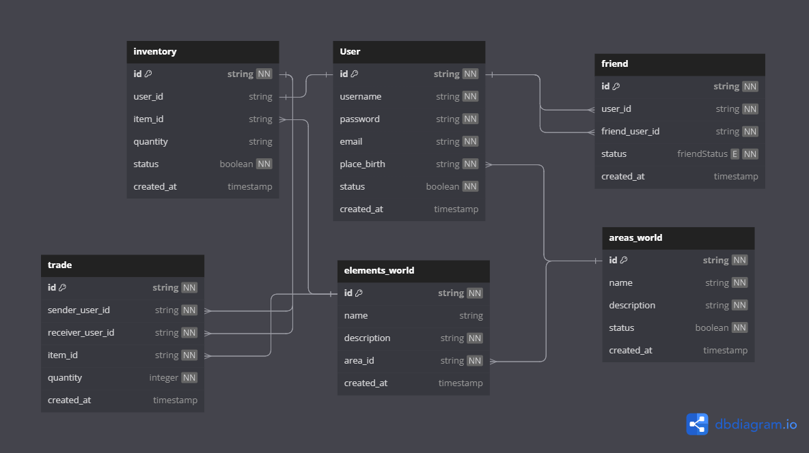

## RealmQuest: Tesoros Intercambiables

Explora el fascinante mundo de RealmQuest, un emocionante juego de aventuras y exploración en línea
donde las oportunidades son tan vastas como los horizontes que se despliegan ante ti.
Sumérgete en un reino lleno de misterio, tesoros y desafíos esperando a ser descubiertos.

En RealmQuest, tú eres el protagonista de tu propia leyenda. Viaja a través de vastos paisajes,
desde densos bosques hasta áridos desiertos, descubriendo áreas secretas y ocultos tesoros
a lo largo del camino. Cada rincón del mundo está lleno de elementos valiosos que pueden ser
recolectados y añadidos a tu inventario personal.

Pero eso no es todo. En el corazón de RealmQuest yace la capacidad de comerciar con otros jugadores.
Forja alianzas, haz amigos y participa en emocionantes intercambios donde puedes intercambiar los
tesoros que has encontrado por los que otros aventureros han descubierto. Cada comercio es una
oportunidad para fortalecer tu personaje, obtener objetos únicos y establecer tu lugar en la
historia de este vibrante mundo en línea.

Prepárate para una experiencia en la que la exploración, la camaradería y la estrategia se unen.
¡Desafía a tus amigos, descubre tesoros perdidos
y haz tu marca en RealmQuest: ¡Tesoros Intercambiables!

- Administrador de base de datos:
  Hola soy el administrador de base de datos, te dejare el diagrama entidad relación
  para que realices la implementación de la base de datos.
  
